# Domain Model Diagram

Este diagrama muestra el modelo de dominio persistido de Organizr como clases de dominio con sus métodos relevantes por feature.

- Entidades raíz persistidas: `UserProfile`, `Extractor`, `ExtractionRecord`, `OAuthCode`, `Ticket`
- Value objects embebidos: `GmailConnection`, `LlmSettings`, `LlmConsumeMonth`, `ExtractorSubject`, `SchemaField`
- Los métodos listados corresponden a funciones del código que crean, leen, actualizan o procesan cada clase

```mermaid
classDiagram
  direction LR

  class UserProfile {
    <<Entity>>
    +uid: string
    +email: string
    +displayName: string
    +photoURL: string
    +createdAt: string
    +updatedAt: string
    +createUserProfileFromFirebaseUser()
    +getUserProfileById()
    +loadUserProfileForRequest()
    +loadRequiredUserProfileForRequest()
    +saveUserProfile()
    +updateProfile()
    +sanitizeUserProfile()
    +createUserCapabilities()
    +incrementUserLlmConsumeForMonth()
  }

  class GmailConnection {
    <<Value Object>>
    +accessToken: string
    +connectedAt: string
    +expiresAt: string
    +revokedAt: string
    +connectGmail()
    +revokeGmail()
    +expireGmailConnectionIfNeeded()
    +isGmailConnectionActive()
  }

  class LlmSettings {
    <<Value Object>>
    +defaultProvider: string
    +geminiApiKey: string
    +openAiApiKey: string
    +normalizeUserLlmSettings()
    +normalizeLlmProvider()
    +updateUserLlmSettingsFromRequest()
  }

  class LlmConsumeMonth {
    <<Value Object>>
    +requestCount: int
    +promptTokenCount: int
    +candidateTokenCount: int
    +totalTokenCount: int
    +createConsumeMonthKey()
    +incrementUserLlmConsumeForMonth()
  }

  class Extractor {
    <<Entity / Aggregate Root>>
    +id: string
    +userId: string
    +name: string
    +query: string
    +explanation: string
    +sampleEmails: EmailMessage[]
    +sampleExtractedResults: SampleExtractionResult[]
    +webhookUrl: string
    +enabledSchedule: boolean
    +triggerCount: int
    +operationCount: int
    +createdAt: string
    +createExtractor()
    +saveExtractor()
    +listExtractors()
    +listExtractorsForUser()
    +getExtractor()
    +getExtractorByIdForUser()
    +loadExtractorContextById()
    +updateExtractor()
    +updateExtractorById()
    +deleteExtractor()
    +deleteExtractorById()
    +toggleSchedule()
    +updateWebhook()
    +triggerExtractor()
    +editExtractorSchema()
    +buildExtractorSchemaEditPrompt()
    +createExtractorStoredSamples()
    +createSchemaEditManualPayload()
    +createSchemaEditCurrentSamples()
    +createSchemaEditStoredSamples()
    +normalizeFirestoreExtractor()
    +normalizeExtractorSubjects()
    +getUniqueSubjectValues()
    +listGptExtractors()
    +getGptExtractor()
    +createExtractorFromSubject()
    +createExtractorFromCustomGptAnalysis()
    +persistGptAnalysisResult()
  }

  class ExtractorSubject {
    <<Value Object>>
    +id: string
    +value: string
    +createdAt: string
    +lastScannedAt: string
    +scriptCode: string
    +createExtractorSubject()
    +getExtractorSubjects()
    +listExtractorSubjects()
    +getExtractorSubject()
    +addExtractorSubject()
    +updateExtractorSubject()
    +deleteExtractorSubject()
    +validateSchemaAgainstSample()
  }

  class EmailMessage {
    <<Value Object>>
    +id: string
    +threadId: string
    +subject: string
    +from: string
    +date: string
    +snippet: string
    +body: string
  }

  class SampleExtractionResult {
    <<Value Object>>
    +emailId: string
    +extractedData: string
  }

  class SchemaField {
    <<Value Object>>
    +fieldName: string
    +fieldType: string
    +description: string
    +exampleValue: string
    +calculation: string
    +computedSourceField: string
    +computedPrompt: string
    +computedFallback: string
    +createSchemaFieldResponseSchema()
    +normalizeComputedSchemaField()
    +normalizeComputedSchemaFields()
    +getComputedSchemaFields()
    +isComputedSchemaField()
    +inferComputedSourceField()
  }

  class ExtractionRecord {
    <<Entity>>
    +id: string
    +extractorId: string
    +userId: string
    +emailId: string
    +subject: string
    +from: string
    +date: string
    +timestamp: string
    +computedStatus: string
    +pendingComputedFields: string[]
    +extractedData: object
    +createOperationDocumentId()
    +createOperationRecord()
    +createExtractionRecordFromSchemaResult()
    +normalizeFirestoreOperation()
    +saveNewOperationsForExtractor()
    +saveNewOperationsWithComputedFields()
    +listOperationsForExtractor()
    +listExtractorOperations()
    +listExistingOperationEmailIds()
    +listPendingOperationsForUser()
    +resolvePendingOperationsForExtractor()
    +resolvePendingOperationsForUser()
    +createPendingComputedRecord()
    +createPendingComputedOperations()
    +createPendingComputedFieldNames()
    +listPendingComputedOperations()
    +processPendingComputedOperations()
    +resolveComputedFieldsForRecords()
    +resolveComputedFieldValue()
    +generateComputedFieldValueWithLlm()
    +generateComputedFieldValueWithGemini()
    +buildComputedFieldPrompt()
    +interpolateComputedPrompt()
    +hasUsableComputedValue()
    +normalizeComputedComparableValue()
  }

  class OAuthCode {
    <<Entity>>
    +code: string
    +firebaseIdToken: string
    +uid: string
    +clientId: string
    +redirectUri: string
    +scope: string
    +createdAt: string
    +expiresAt: string
    +usedAt: string
    +createOAuthCode()
    +consumeOAuthCode()
    +createOAuthCodeFromRequest()
    +exchangeOAuthToken()
    +createOAuthActionUrl()
    +normalizeOAuthRedirectUri()
    +getCustomGptOAuthConfig()
  }

  class Ticket {
    <<Entity>>
    +id: string
    +description: string
    +urgency: int
    +state: string
    +user: string
    +userId: string
    +createdAt: timestamp
    +updatedAt: timestamp
    +createCodexTicket()
    +createGptTicket()
    +listTicketsForCodex()
    +updateTicketStateById()
  }

  UserProfile *-- GmailConnection : embeds
  UserProfile *-- LlmSettings : embeds
  UserProfile *-- LlmConsumeMonth : tracks by month

  UserProfile "1" --> "*" Extractor : owns
  UserProfile "1" --> "*" ExtractionRecord : owns
  UserProfile "1" --> "*" OAuthCode : authorizes
  UserProfile "1" --> "*" Ticket : creates

  Extractor *-- ExtractorSubject : contains
  Extractor *-- SchemaField : defines
  Extractor *-- EmailMessage : stores samples
  Extractor *-- SampleExtractionResult : stores parsed sample outputs
  Extractor "1" --> "*" ExtractionRecord : produces
```

## Notas

- Colecciones reales de Firestore: `users`, `extractors`, `operations`, `oauthCodes`, `tickets`.
- `GmailConnection`, `LlmSettings`, `LlmConsumeMonth`, `ExtractorSubject`, `SchemaField`, `EmailMessage` y `SampleExtractionResult` se guardan embebidos dentro de documentos raíz.
- `ExtractionRecord.extractedData` es un objeto dinámico cuyo shape depende de `Extractor.schemaFields`.
- Los campos computed viven dentro de `ExtractionRecord`, no en una entidad aparte.
- `Extractor` es el aggregate root del modelo de extracción: contiene sus `subjects` y `schemaFields`.
- Los métodos son referencias de dominio al código actual; no implican que esas funciones estén implementadas como métodos de clase en TypeScript.
