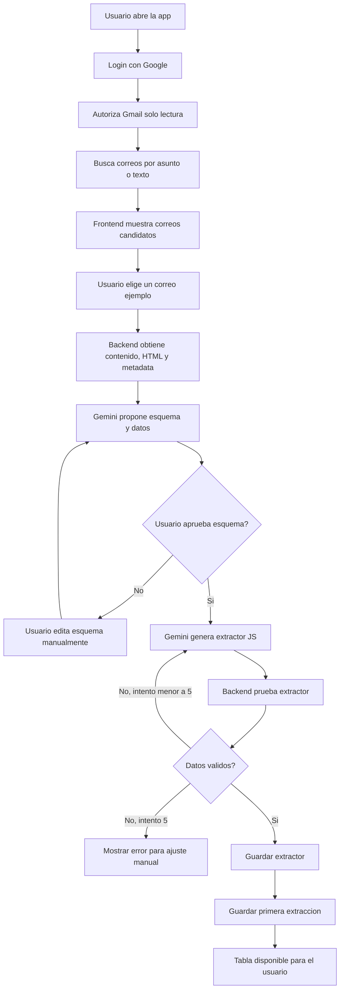

# Flujo Del Producto

Este documento baja la idea a un recorrido claro para producto, frontend y backend.

## Resumen Simple

La app permite que una persona entre con Google, conecte Gmail en modo solo lectura, elija un tipo de correo y convierta correos similares en datos ordenados dentro de una tabla.

El primer correo sirve como ejemplo. Gemini propone un esquema, extrae datos y genera un extractor JS reutilizable. Luego la app usa ese extractor para nuevos correos del mismo tipo.

## Diagrama Principal

## Datos Que Deben Viajar

- Desde Gmail: id del correo, asunto, remitente, fecha, snippet, texto plano y HTML.
- Hacia Gemini: contenido del correo, objetivo del usuario y esquema actual si existe.
- Desde Gemini: esquema propuesto, datos extraidos, confianza y script extractor JS.
- Hacia Firestore: extractor aprobado, usos, resultados y estado de schedule.

## Decisiones Cerradas

- Gmail se usara solo con permiso de lectura.
- El id interno del correo se guarda oculto para evitar duplicados.
- El extractor se guarda como string JS asociado al usuario.
- Cada extractor tiene contador de usos.
- Cada ejecucion crea un documento en `extractors/{id}/extractions`.
- El schedule es fijo por ahora; el usuario solo marca si quiere usarlo.
- Los endpoints externos son opcionales y configurables.

## Pantallas

1. Inicio y login con Google.
2. Permiso de Gmail solo lectura.
3. Busqueda de correo por asunto o texto.
4. Seleccion de correo candidato.
5. Revision de esquema y datos detectados.
6. Edicion manual del esquema.
7. Tabla de extracciones.
8. Agregar nuevos correos al extractor actual.
9. Configurar endpoint externo.

## Backend

- `searchEmails`: busca correos candidatos en Gmail.
- `analyzeEmail`: envia correo a Gemini y devuelve esquema mas datos.
- `generateExtractor`: crea script JS para el esquema aprobado.
- `testExtractor`: ejecuta el script contra el correo ejemplo.
- `saveExtractor`: guarda extractor y primera extraccion.
- `runScheduledExtractors`: ejecuta extractores marcados como schedule.
- `sendToThirdParty`: envia datos transformados a endpoint externo.

## Reglas De Calidad

- Todo endpoint de backend debe tener script de test.
- El extractor nunca debe modificar datos externos durante pruebas.
- El backend debe validar que el correo pertenece al usuario autenticado.
- Si Gemini falla 5 veces, el flujo debe pedir ajuste manual.
- La UI debe mostrar datos antes de guardarlos.

