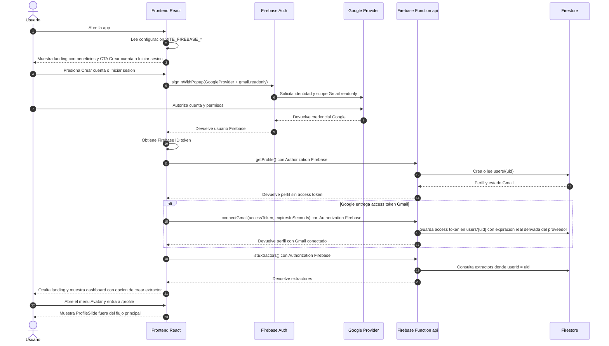
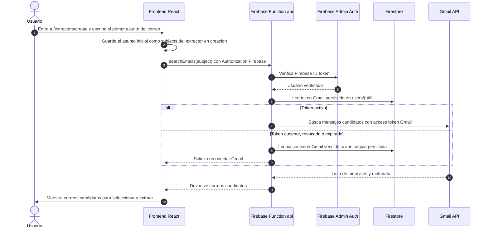
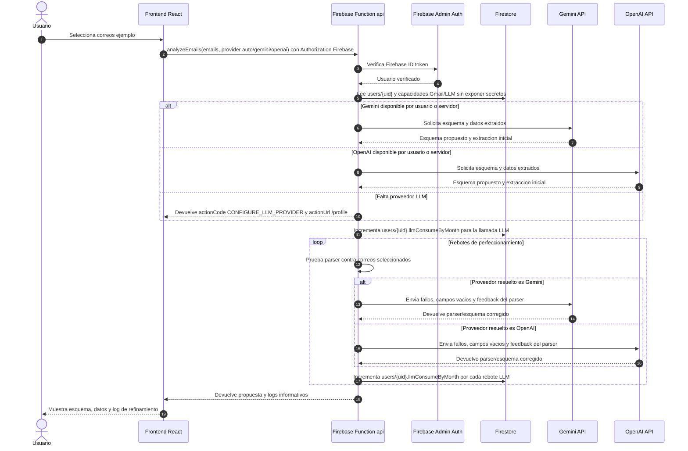
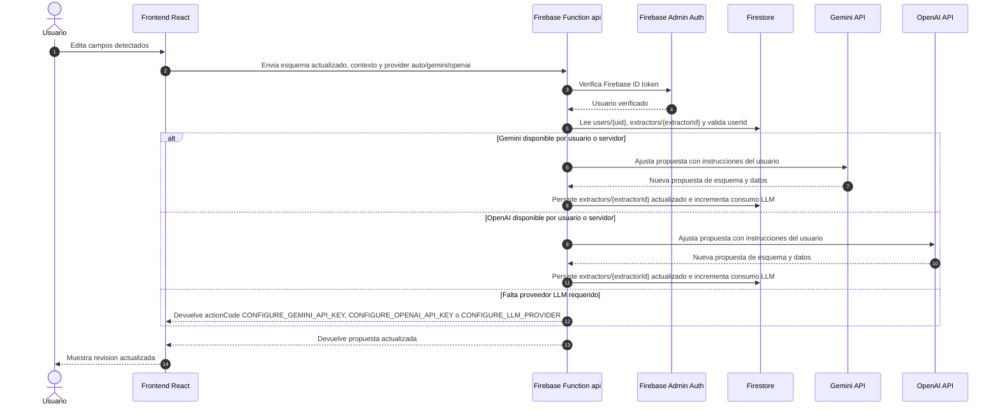
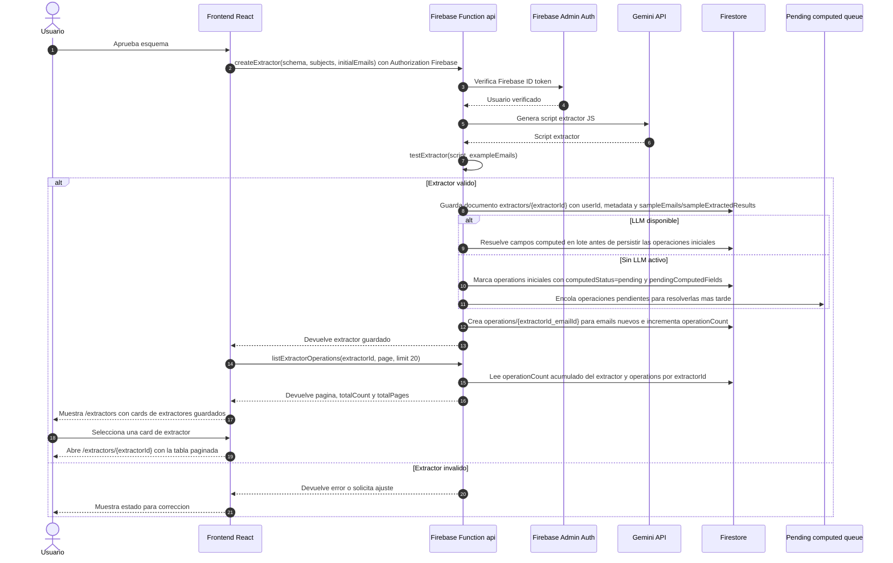
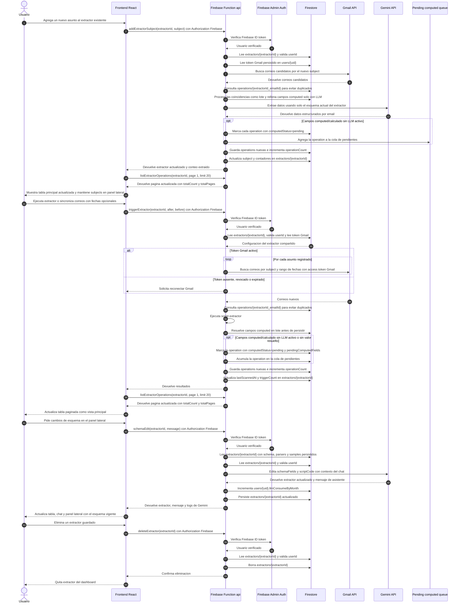
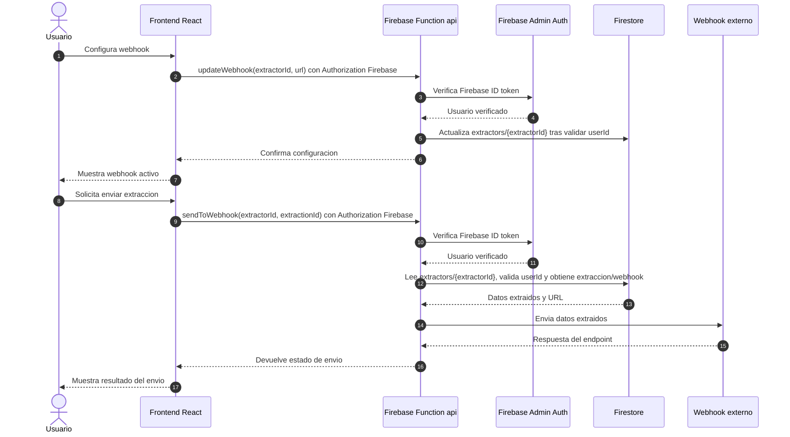
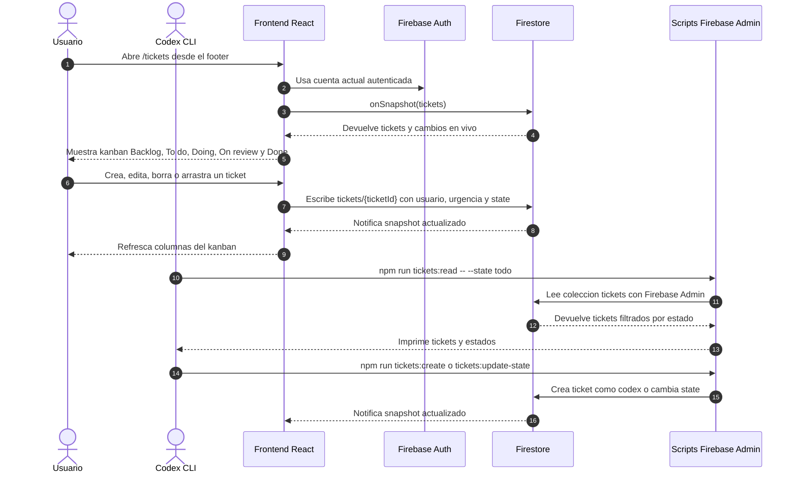
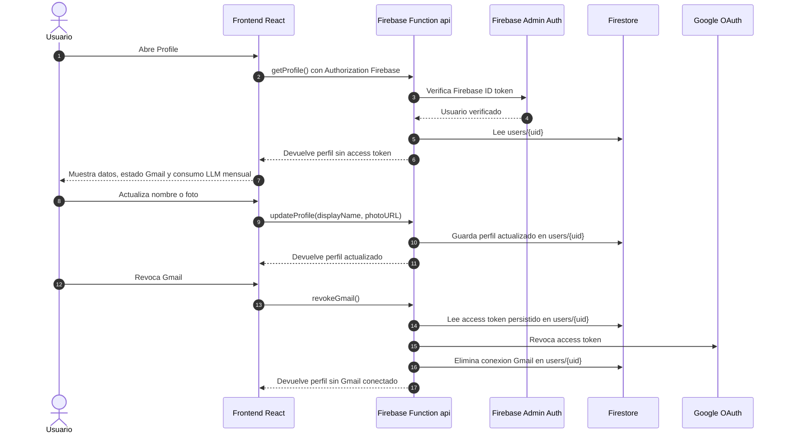
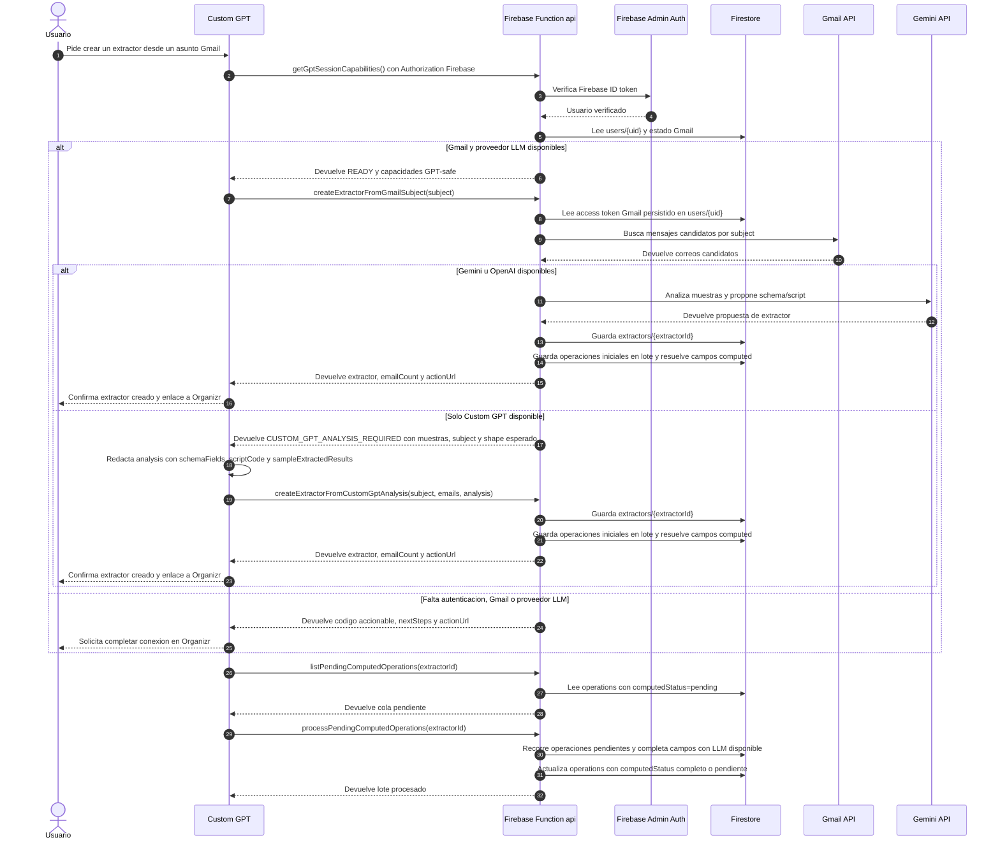

# Sequence Diagrams

Este documento describe el flujo vivo por historias de usuario. Debe actualizarse cuando cambien pantallas, endpoints, integraciones o persistencia.

## Historia 1: Autenticarse Con Firebase Auth Y Autorizar Gmail

## Historia 2: Crear Extractor Con Primer Asunto Y Buscar Correos Candidatos

## Historia 3: Analizar Un Correo Y Proponer Esquema

## Historia 4: Ajustar Esquema Antes De Aprobar

## Historia 5: Crear Y Guardar Extractor

## Historia 6: Ejecutar Extractor Existente Y Agregar Asuntos

## Historia 7: Configurar Y Enviar A Webhook Externo

## Historia 8: Gestionar Tickets En Kanban

## Historia 9: Ver Perfil, Actualizar Datos Y Revocar Gmail

## Historia 10: Crear Extractor Desde Custom GPT Y Completar Análisis Manual

