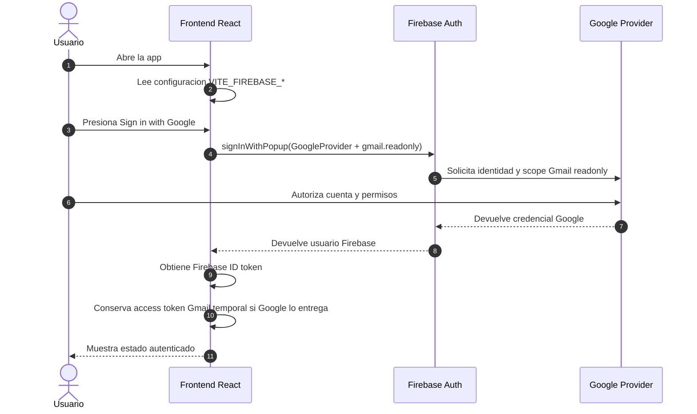
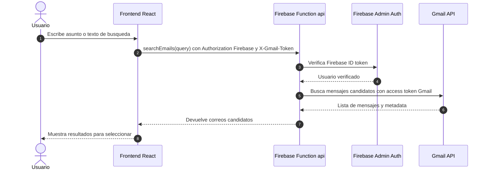
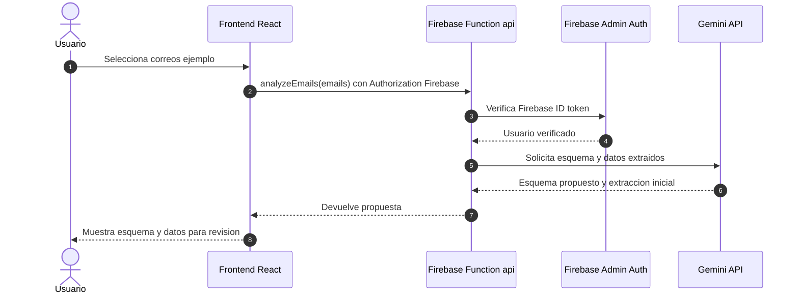
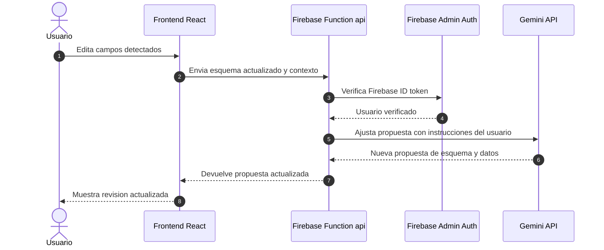
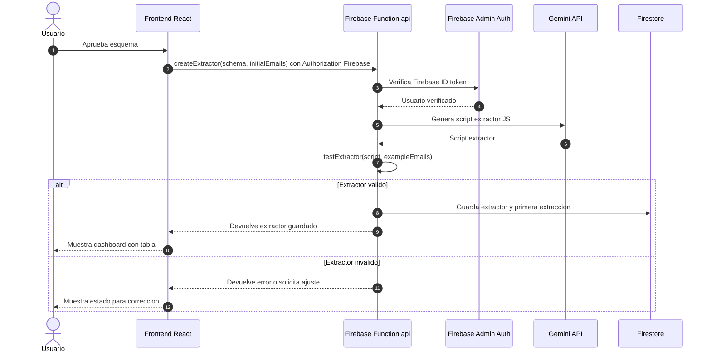
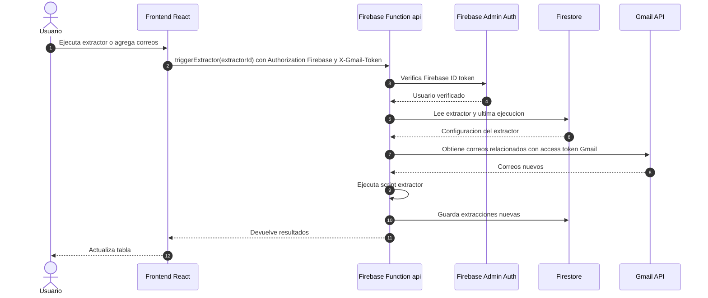
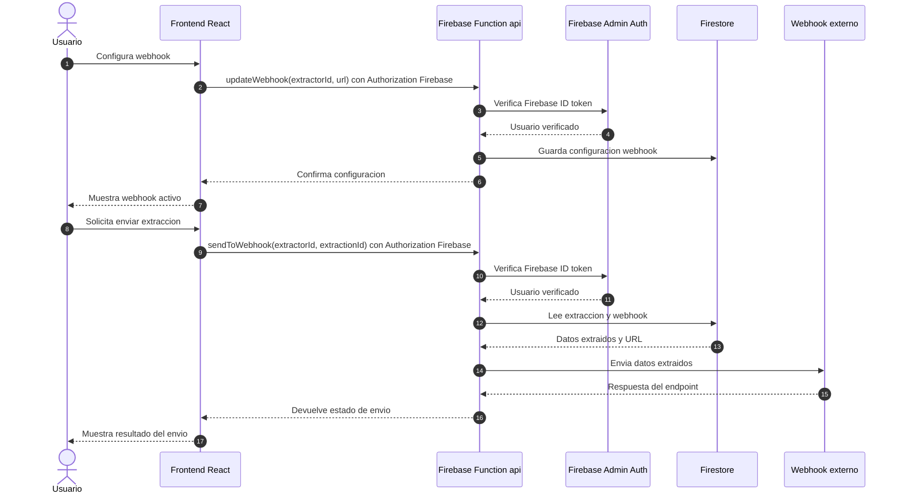

# Sequence Diagrams

Este documento describe el flujo vivo por historias de usuario. Debe actualizarse cuando cambien pantallas, endpoints, integraciones o persistencia.

## Historia 1: Autenticarse Con Firebase Auth Y Autorizar Gmail

## Historia 2: Buscar Correos Candidatos

## Historia 3: Analizar Un Correo Y Proponer Esquema

## Historia 4: Ajustar Esquema Antes De Aprobar

## Historia 5: Crear Y Guardar Extractor

## Historia 6: Ejecutar Extractor Existente

## Historia 7: Configurar Y Enviar A Webhook Externo

